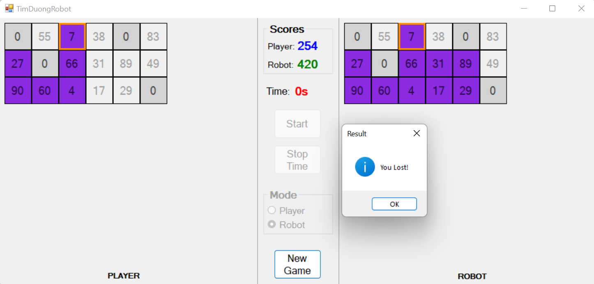

# TimDuongRobot (RobotFindPath)

This repository provides RobotFindPath - project code sample.

## Overview

This project app is written in C# Windows Forms.

The algorithm used by this project is [Brute-force search](https://en.wikipedia.org/wiki/Brute-force_search).

Time complexity is O( $2^n$ )

## Gameplay

The player will play against a robot. The player clicks directly to the cells on the player's panel. Zero-value cells consider a roadblock (cannot be clicked). Each cell can only be clicked once.
Try your best to collect the maximum point on the way before the time runs out. The player's turn end when there is no road left to go or the clock countdown to zero, then the robot will start its turn automatically. The result of the game will pop up on the screen after the robot finish its turn.

Note: *Because of the Brute-force search algorithm, the player cannot win the robot (the best result you can get is draw).*

## Picture

## Recommendations for improvement

* Apply more algorithms (e.g. [Greedy](https://en.wikipedia.org/wiki/Greedy_algorithm)).
* Design better UX/UI.
* Make it online
* ...

## Contributing
Feel free to contribute to this project or just do anything you want with the source code :)
